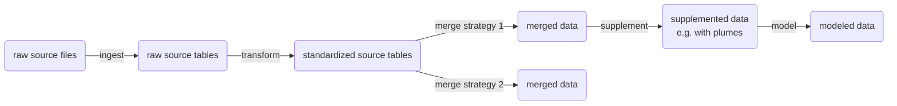

# Standardized Facility Table Specification

## Purpose

This document proposes a database schema for saving facility info from 
individual sources into a standardized form. The process for ingesting data from
a source into this standard form involves light, non-destructive transformation 
of the source data into strict units defined by this specification. The data in 
the standardized form should only include data from the source. This facilitates 
a variety of downstream merging of data from different sources. This standardized 
facility table specification refers to the "standardized source tables" in the 
flowchart below.

A secondary objective is to have a Stitch-compatible format for our source data. 
I have met with Stitch team members multiple times to review and assess if this 
format is in the right direction of being Stitch-compatible.

This document describes the specification and provides a codebook with full 
descriptions of the values, as well as other related information. Additionally, 
a [SQL definition file](sql/standardized_facility.sql) defines the enums and 
the standardized facility table structure in strict SQL form. It is expected 
that the [SQL definition file](sql/standardized_facility.sql) is used to build 
the enums and the template standardized facility table in the database. The 
template standardized facility table in the database could be used to validate 
incoming standardized facility tables during the creation process. It is 
recommended to validate against the SQL definition so there's a single source 
of truth, rather than building a separate Python schema that would then require 
keeping in sync with the SQL definition. Note that the SQL definition strictly 
defines the column names and order, and the column types and allowable ranges, 
however, the conceptual meanings and intended units can not reasonsbly be 
defined in SQL, therefore this specification document defines those things 
strictly, and the onus is on each of the transoform scripts for each source to 
conform to that specification (e.g. SQL can validate that a value of `2354.67` 
is numeric, but it can not validate whether that value is in kg or tons).

It is recommended to name standardized facility tables in the form `std_facility_tbl_[data source ID]`, e.g. `std_facility_tbl_ghgrp_2026`.

### process flow

### data flow

## Schema

| Field | Type | Range | Description |
|---|---|---|------------------|
| `facility_id` | text |  | source data unique ID of facility (text because some sources may use alpha-numeric IDs) |
| `year` | integer | 1950-2080 | The year to which all non-null values in the record apply. A source record may be transformed into multiple standardized records when different measurements refer to different years. |
| `facility_name` | text |  | Facility name as reported by the source. |
| `iso3c_plus` | `iso3c_plus` enum |  | Country or region in which the facility is physically located, as reported or derived from the source, represented using ISO 3166-1 alpha-3 codes plus special values 'XKX' (Kosovo), 'ZNC' (Northern Cyprus), and 'UNK' (unknown). |
| `area` | numeric |  | Surface area of the landfill footprint containing waste, expressed in square meters. |
| `facility_status` | `facility_status` enum |  | Operational status of the facility during the specified year. |
| `facility_type` | `facility_type` enum |  | Classification of the facility according to the standardized facility taxonomy. |
| `opening_year` | integer |  | Year that the facility opened as reported by the source. |
| `closing_year` | integer |  | Year that the facility closed or is expected to close, as reported by the source. |
| `has_landfill_gas_collection` | boolean |  | Indicates whether the facility has a landfill gas collection system. |
| `waste_depth_meters` | numeric | > 0 | Estimated average depth of waste during the specified `year` in meters. |
| `annual_incoming_waste_metric_tonnes` | numeric | ≥ 0 | Quantity of waste accepted by the facility during the specified `year`, expressed in metric tonnes. |
| `waste_in_place_metric_tonnes` | numeric | ≥ 0 | Estimated total waste mass in place during the specified `year`, expressed in metric tonnes. |
| `has_cover` | boolean |  | Indicates whether any cover material is present at the facility. |
| `cover_types` | array of `cover_type` enum |  | All cover types reported for the facility during the specified `year`. |
| `gccs_ch4_flared_metric_tonnes` | numeric | ≥ 0 | Quantity of methane routed to flaring devices by the gas collection and control system (GCCS) during the specified `year`, expressed in metric tonnes CH₄. |
| `gccs_ch4_generated_metric_tonnes` | numeric | ≥ 0 | Quantity of methane generated by the landfill during the specified `year`, expressed in metric tonnes CH₄. |
| `gccs_ch4_collected_metric_tonnes` | numeric | ≥ 0 | Quantity of methane collected by the landfill during the specified `year`, expressed in metric tonnes CH₄. |
| `gccs_energy_project_type` | array of `gccs_energy_project_type` enum |  | Type of landfill gas energy recovery project associated with the facility during the specified `year`. |
| `gccs_current_project_status` | array of `gccs_current_project_status` enum |  | Operational status of the landfill gas energy recovery project during the specified `year`. |
| `gccs_ch4_flow_to_project_metric_tonnes` | numeric | ≥ 0 | Quantity of methane routed from the gas collection and control system (GCCS) to an energy recovery project during the specified `year`, expressed in metric tonnes CH₄. |
| `gccs_ch4_percent` | numeric | 0-1 | Methane concentration of gas collected by the gas collection and control system (GCCS), expressed as a fraction between 0 and 1. |
| `gccs_collection_efficiency` | numeric | 0-1 | Fraction of generated landfill gas that is collected by the gas collection system, expressed as a value between 0 and 1. |
| `oxidation` | numeric | 0-1 | Oxidation factor applied to methane emissions, expressed as a value between 0 and 1. |
| `mcf` | numeric | 0-1 | Methane Correction Factor (MCF) associated with the facility for the specified year, expressed as a value between 0 and 1. |
| `latitude` | numeric | -90 to 90 | Latitude of the facility location in decimal degrees using the WGS84 coordinate reference system[^3]. Note: some sources may report the location of the facility generally and/or inaccurately, e.g. using the location of the city that the landfill serves |
| `longitude` | numeric | -180 to 180 | Longitude of the facility location in decimal degrees using the WGS84 coordinate reference system[^3]. Note: some sources may report the location of the facility generally and/or inaccurately, e.g. using the location of the city that the landfill serves |
| `is_location_exact` | boolean |  | Indicates whether the facility location specified by `latitude` and `longitude` is an exact location (versus an approximate location). |
| `ch4_emissions_metric_tonnes` | numeric | ≥ 0 | Methane emissions associated with the facility during the specified `year`, expressed in metric tonnes CH₄.|
| `food_percent_by_weight` | numeric | 0-1 | Fraction of waste in place attributed to food by weight. |
| `green_percent_by_weight` | numeric | 0-1 | Fraction of waste in place attributed to green by weight. |
| `wood_percent_by_weight` | numeric | 0-1 | Fraction of waste in place attributed to wood by weight. |
| `paper_cardboard_percent_by_weight` | numeric | 0-1 | Fraction of waste in place attributed to paper/cardboard by weight. |
| `textiles_percent_by_weight` | numeric | 0-1 | Fraction of waste in place attributed to textiles by weight. |
| `plastic_percent_by_weight` | numeric | 0-1 | Fraction of waste in place attributed to plastic by weight. |
| `metal_percent_by_weight` | numeric | 0-1 | Fraction of waste in place attributed to metal by weight. |
| `glass_percent_by_weight` | numeric | 0-1 | Fraction of waste in place attributed to glass by weight. |
| `rubber_percent_by_weight` | numeric | 0-1 | Fraction of waste in place attributed to rubber by weight. |
| `other_percent_by_weight` | numeric | 0-1 | Fraction of waste in place attributed to other waste types not included in the above categories by weight. |
| `data_source` | `data_source` enum |  | Standardized identifier representing the source dataset and version from which the record was derived. |
| `created_date` | timestamp |  | Timestamp indicating when the standardized record was created. |
| `git_sha` | text |  | Git commit SHA of the ingestion and transformation code used to generate the standardized record. |

## Conversion Standards

### numeric

All numeric measurements should be converted to the following standard units during transformation:

| Source Unit | Standard Unit | Conversion | Notes |
|-------------|---------------|------------|------------|
| feet | meters | meters = feet × 0.3048 | |
| square feet | square meters | square meters = square feet × 0.092903 | |
| acres | square meters | square meters = acres × 4,046.856 | |
| kilograms | metric tonnes | metric tonnes = kilograms ÷ 1,000 | |
| US short tons | metric tonnes | metric tonnes = US short tons × 0.907185 | |
| cubic feet CH₄ | kilograms CH₄ | kg CH₄ = ft³ CH₄ × 0.0192 | Assumes methane density = 0.0192 kg/ft³ (0.679 kg/m³), corresponding approximately to methane at 15°C and 1 atm. If different standard temperature and pressure conditions are used, the conversion factor should be adjusted accordingly.[^1]. |
| million cubic feet per day (MMCFD) | metric tonnes CH₄/year | metric tonnes CH₄/year = MMCFD × 1,000,000 × 365 × methane fraction × 0.0192 ÷ 1000 | |

### categorical

Some categorical values in source data must be mapped to a standardized set of 
categories, analogous to converting numeric measurements into standardized units
(e.g., tons to kilograms). These enums define the standardized categories used 
during transformation of source data into the standardized facility schema.

For `gccs_energy_project_type` and `gccs_current_project_status`, `NULL` is also
permitted in two ways: the entire field may be `NULL`, or individual elements in
the array may be `NULL` when collapsing multiple project rows into a single
facility-year record.

| `facility_status` |
| --- |
| 'Active' |
| 'Inactive' |

| `facility_type` |
| --- |
| 'Sanitary Landfill' |
| 'Controlled Dumpsite' |
| 'Dumpsite' |
| 'Incineration Facility' |

| `cover_type` |
| --- |
| 'clay cover' |
| 'organic cover' |
| 'sand cover' |
| 'other soil mixture' |

| `gccs_energy_project_type` |
| --- |
| 'Electricity Generation' |
| 'Direct Use' |
| 'Renewable Natural Gas' |
| 'Other' |
| `NULL` |

| `gccs_current_project_status` |
| --- |
| 'Operational' |
| 'Under Construction' |
| 'Planned' |
| 'Closed' |
| `NULL` |

### `iso3c_plus`

all [valid ISO 3166-1 alpha-3 codes](https://www.iso.org/iso-3166-country-codes.html)[^2] plus `XKX` for Kosovo, `ZNC` for Northern Cyprus, and `UNK` for unknown

### `data_source`

| `data_source` | Source | Link |
| --- | --- | --- |
| 'usa_ghgrp_2026' | EPA GHGRP data from 2026 | |
| 'canada_ghgrp_2021' | Canada GHGRP data from 2021 | |
| 'eprtr_2022' | EPRTR methane data through 2022 | |
| 'gpw_2021' | Global Plastic Watch landfill inventory snapshot for 2021 | |
| 'mexico_inegi_2016' | Mexico INEGI landfill dataset for 2016 | |
| 'osm_2022' | OpenStreetMap-derived landfill inventory snapshot for 2022 | |
| 'waste_atlas_dumpsites_2013' | Waste Atlas dumpsites dataset for 2013 | |
| 'waste_atlas_landfills_2013' | Waste Atlas landfills dataset for 2013 | |
| 'lmop_2024' | EPA LMOP data from 2024 | [Direct Download](https://www.epa.gov/system/files/documents/2024-09/lmopcompositedata.xlsx) |
| 'sinir_2024' | SINIR (Brazilian government waste data) landfill/facility dataset, pulled 2024 | |
| 'manual_entry' | Facilities entered by hand into the production database with no upstream source. Carries no year suffix because the entry year varies per row - see the `year` column, which is sourced per row from the entry timestamp. | |

## Examples

### year transform example

source data:

| `facility_id` | `reporting_year` | `waste_in_place_metric_tons` | `waste_in_place_year` | `ch4_emissions_metric_tonnes` | `emissions_year` |
|----|----|----|----|----|----|
| 123456 | 2024 | 3454.34 | 2023 | 0.57 | 2022 |

standardized:

| `facility_id` | `year` | `waste_in_place_metric_tons` | `ch4_emissions_metric_tonnes` |
|----|----|----|----|
| 123456 | 2023 | 3454.34 | null |
| 123456 | 2022 | null | 0.57 |

### example standardized facility table with two records

| Field | Record 1 | Record 2 |
|---------------------------|----------------------|----------------------|
| `facility_id` | US425443 | US425443 |
| `year` | 2024 | 2025 |
| `facility_name` | 'ABC Regional Landfill' | 'ABC Regional Landfill' |
| `iso3c_plus` | 'USA' | 'USA' |
| `area` | 2345000 | 2345000 |
| `facility_status` | 'Active' | 'Active' |
| `facility_type` | 'Sanitary Landfill' | 'Sanitary Landfill' |
| `opening_year` | 1998 | 1998 |
| `closing_year` | 2045 | 2045 |
| `has_landfill_gas_collection` | True | True |
| `waste_depth_meters` | 34.4 | 37.1 |
| `annual_incoming_waste_metric_tonnes` | 343453 | 363472 |
| `waste_in_place_metric_tonnes` | 9028420 | 9381892 |
| `has_cover` | True | True |
| `cover_types` | ['clay cover', 'sand cover'] | ['clay cover', 'sand cover'] |
| `gccs_ch4_flared_metric_tonnes` | 5100 | 5470 |
| `gccs_ch4_generated_metric_tonnes` | 65000 | 69960 |
| `gccs_ch4_collected_metric_tonnes` | 57000 | 59660 |
| `gccs_energy_project_type` | 'Electricity Generation' | 'Electricity Generation' |
| `gccs_current_project_status` | 'Operational' | 'Operational' |
| `gccs_ch4_flow_to_project_metric_tonnes` | 43000 | 47000 |
| `gccs_ch4_percent` | 0.52 | 0.53 |
| `gccs_collection_efficiency` | 0.74 | 0.75 |
| `oxidation` | 0.10 | 0.10 |
| `mcf` | 1.00 | 1.00 |
| `latitude` | 41.8781 | 41.8781 |
| `longitude` | -87.6298 | -87.6298 |
| `is_location_exact` | True | True |
| `ch4_emissions_metric_tonnes` | 14500 | 13800 |
| `food_percent_by_weight` | 0.22 | 0.21 |
| `green_percent_by_weight` | 0.10 | 0.10 |
| `wood_percent_by_weight` | 0.08 | 0.08 |
| `paper_cardboard_percent_by_weight` | 0.24 | 0.24 |
| `textiles_percent_by_weight` | 0.07 | 0.07 |
| `plastic_percent_by_weight` | 0.15 | 0.16 |
| `metal_percent_by_weight` | 0.04 | 0.04 |
| `glass_percent_by_weight` | 0.03 | 0.03 |
| `rubber_percent_by_weight` | 0.02 | 0.02 |
| `other_percent_by_weight` | 0.05 | 0.05 |
| `data_source` | 'ghgrp_2026' | 'ghgrp_2026' |
| `created_date` | 2026-05-12 14:22:31 | 2026-05-12 14:22:31 |
| `git_sha` | d14d37587b08183a959d3ba7225869916a1370a1 | d14d37587b08183a959d3ba7225869916a1370a1 |

## References and Sources

[^1]: [GHG Manuscript Supporting Information](https://pasteur.epa.gov/uploads/10.23719/1518680/GHG%20Manuscript%20Supporting%20Information.docx?utm_source=chatgpt.com)
[^2]: [ISO 3166-1 country codes](https://www.iso.org/iso-3166-country-codes.html)
[^3]: [WORLD GEODETIC SYSTEM 1984 (WGS 84)](https://earth-info.nga.mil/index.php?dir=wgs84&action=wgs84)
